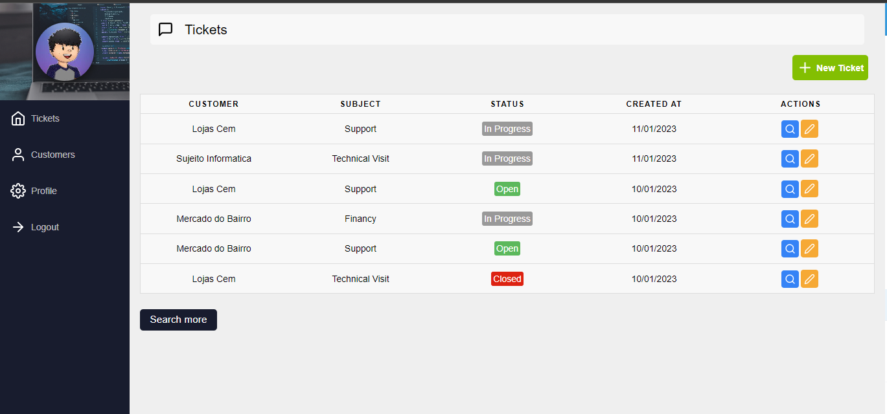

# Tickets System

**See the project online:**
https://ticketssystem.netlify.app/

username: joao@email.com
password: 123123

# Descripition 

The project **Tickets System** is a project developed during **Sujeito Programador** classes. The purpose of the application is to create a system to register and control tickets, in which the user can create an account, add a customer, and register a ticket for one of the registered customers. The dashboard will list all the cases ordered by date and the ticket status(Open, Progress, Close).

**Sujeito Programador:**
https://sujeitoprogramador.com/

  

## 🛠️ Features

- Sign In and Sign Up
- Edit Profile
- Image upload
- Add customers, tickets
- List Tickets
- Edit Tickets
- View case details in a modal

## 📡 Technologies 

 

  

  

## 🔎 Project Status 

 

## 🌍 Find me

- [Linkedin](https://www.linkedin.com/in/joao-lopes-071026198/)